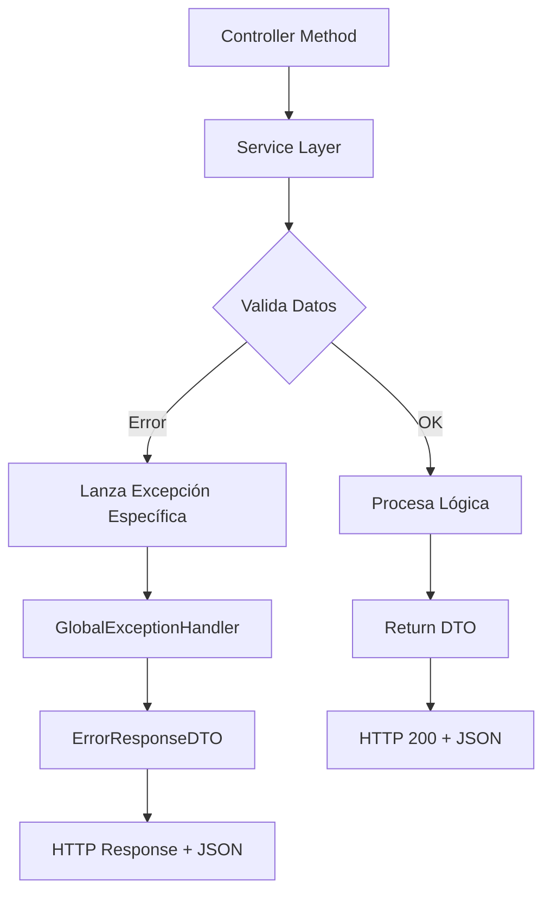

# 🔍 **Análisis de Excepciones Personalizadas vs GlobalExceptionHandler**

## ✅ **Conclusión: Las Excepciones Personalizadas SÍ son Útiles**

Después de analizar el código y realizar las optimizaciones, **las excepciones personalizadas siguen siendo valiosas** en la arquitectura de la aplicación.

## 🏗️ **Arquitectura de Manejo de Errores Optimizada**

### **Antes (Problemático):**
```java
// ❌ Manejo duplicado y inconsistente en cada controlador
@PostMapping
public ResponseEntity<TopicoResponseDTO> crear(@RequestBody TopicoRequestDTO dto) {
    try {
        return ResponseEntity.ok(service.crear(dto));
    } catch (DuplicatedTopicException e) {
        return ResponseEntity.status(409).build(); // Sin mensaje
    } catch (EntityNotFoundException e) {
        return ResponseEntity.status(404).build(); // Sin mensaje
    } catch (Exception e) {
        return ResponseEntity.status(500).build(); // Sin mensaje
    }
}
```

### **Después (Optimizado):**
```java
// ✅ Controlador limpio y simple
@PostMapping
public ResponseEntity<TopicoResponseDTO> crear(@RequestBody TopicoRequestDTO dto) {
    return ResponseEntity.ok(service.crear(dto)); // GlobalExceptionHandler maneja todo
}

// ✅ Servicio expresivo y claro
public TopicoResponseDTO crear(TopicoRequestDTO dto) {
    if (existeTituloEnCurso(dto.titulo(), dto.cursoId())) {
        throw new DuplicatedTopicException("Ya existe un tópico con este título");
    }
    // ... lógica
}
```

---

## 🎯 **Beneficios de las Excepciones Personalizadas**

### **1. Semántica Clara en el Código**
```java
// ❌ Ambiguo - ¿Qué tipo de error?
throw new RuntimeException("Error");

// ✅ Específico y claro
throw new DuplicatedTopicException("Ya existe un tópico con el mismo título y autor");
throw new EntityNotFoundException("No se encontró usuario con ID: " + id);
```

### **2. Control Granular en GlobalExceptionHandler**
```java
@ExceptionHandler(EntityNotFoundException.class)
public ResponseEntity<ErrorResponseDTO> handleEntityNotFound(EntityNotFoundException ex) {
    return ResponseEntity.status(404).body(createError("Not Found", ex.getMessage()));
}

@ExceptionHandler(DuplicatedTopicException.class)
public ResponseEntity<ErrorResponseDTO> handleDuplicatedTopic(DuplicatedTopicException ex) {
    return ResponseEntity.status(409).body(createError("Conflict", ex.getMessage()));
}

@ExceptionHandler(RuntimeException.class) // Catch-all para otros errores
public ResponseEntity<ErrorResponseDTO> handleRuntime(RuntimeException ex) {
    return ResponseEntity.status(400).body(createError("Bad Request", ex.getMessage()));
}
```

### **3. Documentación Automática en Swagger**
```java
@ApiResponse(responseCode = "404", description = "❌ Recurso no encontrado")
@ApiResponse(responseCode = "409", description = "⚠️ Recurso duplicado")
```

### **4. Facilita Testing y Debugging**
```java
@Test
void deberiaLanzarExcepcionCuandoTopicoEsDuplicado() {
    // Arrange
    TopicoRequestDTO dto = new TopicoRequestDTO("Título", "Mensaje", 1, 1);
    
    // Act & Assert
    assertThrows(DuplicatedTopicException.class, () -> {
        topicoService.crear(dto);
    });
}
```

---

## 📊 **Mapeo de Excepciones a Códigos HTTP**

| Excepción Personalizada | Código HTTP | Uso Semántico |
|------------------------|-------------|---------------|
| `EntityNotFoundException` | **404** | Recurso no encontrado |
| `DuplicatedTopicException` | **409** | Conflicto por duplicación |
| `IllegalArgumentException` | **400** | Datos inválidos |
| `AccessDeniedException` | **403** | Sin permisos |
| `AuthenticationException` | **401** | No autenticado |
| `Exception` (catch-all) | **500** | Error interno |

---

## 🔄 **Flujo de Manejo de Errores Actual**



---

## 🚀 **Ventajas de la Arquitectura Actual**

### **✅ Para Desarrolladores:**
- **Controladores limpios** sin bloques try-catch
- **Servicios expresivos** con excepciones semánticas
- **Manejo centralizado** en GlobalExceptionHandler
- **Códigos de error consistentes** en toda la aplicación

### **✅ Para Frontend/Cliente:**
- **Respuestas JSON estandarizadas** con estructura ErrorResponseDTO
- **Códigos HTTP precisos** para lógica de control
- **Mensajes descriptivos** para mostrar al usuario
- **Documentación confiable** en Swagger UI

### **✅ Para Mantenimiento:**
- **Un solo lugar** para cambiar formato de errores
- **Logging centralizado** de excepciones
- **Testing simplificado** de casos de error
- **Debugging eficiente** con stack traces claros

---

## 📝 **Estructura de Archivos de Excepciones**

```
src/main/java/com/rai69/Foro_Hub/exception/
├── DuplicatedTopicException.java    ✅ Mantener - Semántica clara
├── EntityNotFoundException.java     ✅ Mantener - Muy usado
└── GlobalExceptionHandler.java      ✅ Mantener - Control centralizado
```

### **¿Por qué mantener todas?**

1. **DuplicatedTopicException**: Específica para conflictos de duplicación
2. **EntityNotFoundException**: Ampliamente usada en servicios  
3. **GlobalExceptionHandler**: Manejo centralizado y consistente

---

## 🎯 **Recomendación Final**

**MANTENER las tres clases de excepción** ya que:

- ✅ **Mejoran la legibilidad** del código
- ✅ **Facilitan el mantenimiento** a largo plazo  
- ✅ **Proporcionan control granular** de errores
- ✅ **Simplifican los controladores** (sin try-catch)
- ✅ **Garantizan consistencia** en respuestas HTTP
- ✅ **Facilitan el testing** con excepciones específicas

**Tu arquitectura de manejo de errores está ahora optimizada y es una best practice para aplicaciones Spring Boot empresariales.** 🚀
